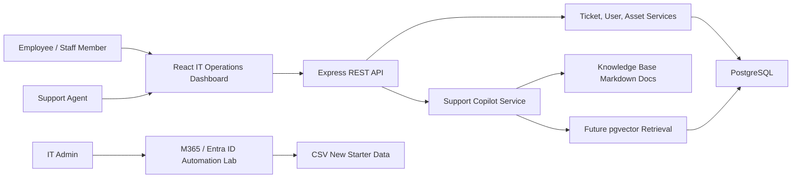
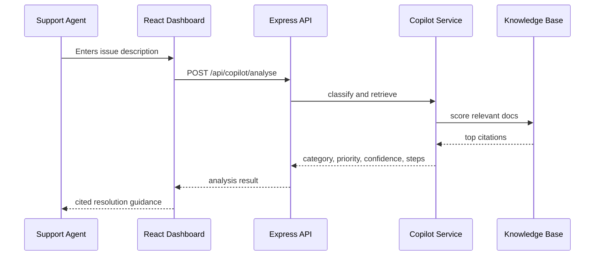

# Architecture

The platform is organised as a practical internal IT service system rather than a generic demo app.

## Core Modules

### Service Desk API

The API exposes seeded support data today and is structured so Prisma/PostgreSQL persistence can be added without changing the frontend contract.

Key responsibilities:

- Ticket lifecycle: open, in progress, waiting for user, resolved, closed
- Ticket categories: account, Microsoft 365, VPN, network, hardware, software, email, Teams
- Priority and SLA fields for realistic triage
- User and department data
- Asset assignment and device health
- Copilot analysis endpoint

### Support Copilot

The copilot follows a simple RAG-shaped workflow:

1. Classify the issue text with category keywords.
2. Score knowledge base documents against the issue.
3. Return the most relevant citations.
4. Generate suggested steps from matched support patterns.
5. Provide a confidence score and escalation hint.

The current implementation is deterministic so it can run in demos and tests without paid AI keys. The next step is to replace the keyword retriever with embeddings in pgvector and add optional OpenAI generation.

### React Dashboard

The dashboard is built for support-agent workflows:

- Dense operational overview
- Ticket filters and status scanning
- Ticket details with user, device, comments, and SLA context
- Asset and onboarding panels
- Copilot panel with cited suggestions

### Microsoft 365 / Entra ID Lab

The lab keeps real IT Support language in the portfolio. It uses CSV input and PowerShell scripts that can run as a mock workflow, with comments showing where Microsoft Graph calls would be added in a real tenant.

## Data Flow

## Production Direction

- Add Prisma migrations for users, tickets, assets, comments, audit logs, and knowledge chunks.
- Add pgvector embeddings for document retrieval.
- Add auth with role-based access control.
- Add OpenAPI-generated client types for the frontend.
- Deploy web to Vercel or Azure Static Web Apps and API to Render, Fly.io, Railway, Azure App Service, or a container host.

